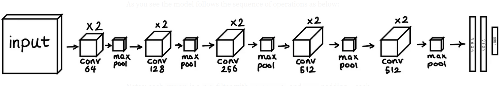

# Projet AADA 2024 - Examen final

L'objectif de ce sujet est d'évaluer vos connaissances concernant la mise en place d'une architecture neuronale capable d'assurer une fonction de classification d'images.

L'ensemble des codes Keras que vous avez produit pendant les séances sont autorisés pendant l'examen. A la fin de l'épeuve vous m'enverrez votre "notebook examen" par email
à l'adresse : sebastien.ambellouis@gmail.com. Je vous demande d'annoter et de commenter votre "notebook" à l'aide des cellules de texte afin de montrer votre
compréhension des opérations que vous effectuerez. Vous devez donc me rendre un notebook clair et facilement exploitable.

Ma correction est simple : j'exécute chaque cellule de votre notebook et je vérifie si aucune erreur n'apparaît et si le résultat attendu est obtenu.
Si je dois corriger des erreurs alors je poserai des pénalités.

A vous de jouer ... Bon courage ...

## partie 1 : le réseau de référence

**Question 1**

Définir le réseau suivant à l'aide des fonctions de Keras :



Comme vous pouvez le voir l'architecture est définie ainsi :

__Feature map__ : 2 x CONV2D(64 filtres) -> RELU -> MAXPOOL -> 2 x CONV2D(128 filtres) -> RELU -> MAXPOOL -> 2 x CONV2D(256 filtres) -> RELU -> MAXPOOL -> 2 x CONV2D(512 filtres) -> RELU -> MAXPOOL -> 2 x CONV2D(512) -> RELU -> MAXPOOL
__Classifieur__: FLATTEN -> FC1(4096) -> FC2(4096) -> FC3(1000) -> output

Les filtres sont de taille 3x3 et la fonction d'activation des couches est une RELU.

Cette architcture a été définie initialement pour la base d'images ImageNet. Vous entraînerez par la suite le réseau sur le base CIFAR-10 par conséquent il vous faut faire les modifications sur l'architecture actuelle en tenant compte de la résolution des images de la base CIFAR et du nombre de classes. Le nombre de filtres par couche doit être également adapté.

**Question 2**

Charger les images de la base CIFAR-10 et procéder à la normalisation de chaque image.

**Question 3**

Produire un sous ensemble de validation à partir des images de l'ensemble d'entraînement. 10% des images de l'ensemble d'entraînement seront placées dans la base de valdiation.

**Question 4**

Définir les paramètres nécessaires au lancement de l'entraînement (loss, metrics, nombre d'épochs, taille du batch ...).
L'entrainement devra être mené sur la base de training et l'évaluation à chaque époque sur la base de validation produite à la question 3.
Ajouter la fonction callback afin de sauvegarder les poids du réseau à TOUTES LES EPOCHS. Cela vous permettra de garder les "meilleurs" poids appris pour usage ultérieur.

Une fois l'entraînement lancé et terminé (nombre d'épochs = 40) afficher les courbes d'apprentissage qui permettront de constater ou non un phénomène de sur-apprentissage.

Attention : veillez à ajouter des couches de __dropout__ et de __batchNormalization__ afin d'obtenir les résultats que vous qualifierez d'optimaux.

**Question 5**

Lancer l'évalution de votre meilleur modèle sur la base de test.
Quelle est la précision obtenue ?
Afficher la matrice de confusion de ce modèle.

**Question 6** 

Inférer le modèle sur les images placées dans le dossier evaluation du github : https://github.com/SebAmb/AADA2024/tree/main/evaluation
L'objectif est de vérifier que le modèle est capable de classer ces images parmi les classes apprises.

Voici la liste des classes ```class_names = ['airplane', 'automobile', 'bird', 'cat', 'deer', 'dog', 'frog', 'horse', 'ship', 'truck']```

## Partie 2 : vers un autre cas d'usage

Cette partie n'apporte que des points positifs !

Dans cette partie je vous propose d'appliquer ce réseau afin de classer des images parmis 7 classe d'émotion.
Les images sont enregistrées dans le fichier __icml_face_data.csv__ qui vous été partagé.
Ces images sont en niveau de gris comme les image MNIST.

Voici le script qui permet de conditionner ces données et obtenir les tableaux que vous utiliserez pour l'entraînement et l'évaluation du réseau.
Ces images sont de résolution 48x48 et sont déjà normalisées. La fonction __plot_all_emotions()__ permet d'afficher une image par catégrie.

```
import pandas as pd
import numpy as np
import os
import matplotlib.pyplot as plt
from tensorflow.keras.models import Sequential
from tensorflow.keras.layers import *
from sklearn.metrics import confusion_matrix
from mlxtend.plotting import plot_confusion_matrix

from keras import models
from keras.layers import Dense, Dropout, Flatten, Conv2D, MaxPooling2D
from keras.optimizers import RMSprop,Adam
from keras.utils import to_categorical

# Dossier où est enregistré le fichier des visages
path = '/content/drive/MyDrive/dataset/face/'

# Nom du fichier des visages
data = pd.read_csv(path+'icml_face_data.csv')


def plot_all_emotions():
    fig, axs = plt.subplots(1, 7, figsize=(30, 12))
    fig.subplots_adjust(hspace = .2, wspace=.2)
    axs = axs.ravel()
    for i in range(7):
        idx = data[data['emotion']==i].index[i]
        axs[i].imshow(train_images[idx][:,:,0], cmap='gray')
        axs[i].set_title(emotions[train_labels[idx].argmax()])
        axs[i].set_xticklabels([])
        axs[i].set_yticklabels([])

def prepare_data(data):
    """ Prepare data for modeling 
        input: data frame with labels und pixel data
        output: image and label array """
    
    image_array = np.zeros(shape=(len(data), 48, 48))
    image_label = np.array(list(map(int, data['emotion'])))
    
    for i, row in enumerate(data.index):
        image = np.fromstring(data.loc[row, ' pixels'], dtype=int, sep=' ')
        image = np.reshape(image, (48, 48))
        image_array[i] = image
        
    return image_array, image_label

# Liste des émotions considérées
emotions = {0: 'Angry', 1: 'Disgust', 2: 'Fear', 3: 'Happy', 4: 'Sad', 5: 'Surprise', 6: 'Neutral'}

train_image_array, train_image_label = prepare_data(data[data[' Usage']=='Training'])
val_image_array, val_image_label = prepare_data(data[data[' Usage']=='PrivateTest'])
test_image_array, test_image_label = prepare_data(data[data[' Usage']=='PublicTest'])

train_images = train_image_array.reshape((train_image_array.shape[0], 48, 48, 1))
val_images = val_image_array.reshape((val_image_array.shape[0], 48, 48, 1))
test_images = test_image_array.reshape((test_image_array.shape[0], 48, 48, 1))

# Les trois variables contenant les images d'entraînement, de validation et de test
train_images = train_images.astype('float32')/255
val_images = val_images.astype('float32')/255
test_images = test_images.astype('float32')/255

# Les trois variables contenant les label de chaque sous-ensemble
train_labels = to_categorical(train_image_label)
val_labels = to_categorical(val_image_label)
test_labels = to_categorical(test_image_label)

# Affichage d'une image par émotion
plot_all_emotions()

```
 
Sur la base de ce que vous venez de réaliser dans la partie précédente
ou sur ce que vous connaissez, proposer une architecture convolutionnelle capable d'assurer 
cette classification des émotions. Vous êtes libre de proposer/expérimenter un réseau
tel que l'un de ceuxque nous avons étudiés en cours. Evidemment, vous pourrez faire appel à tous 
les outils ou artifices que vous connaissez désormais : entraînement, évaluation, courbe, précision, matrice de confusion ... 

**La condition principale est de me proposer un réseau dont l'accuracy est supérieure à 0.5 c'est-à-dire meilleur que le tirage aléatoire.**

Enjoy !!!!


